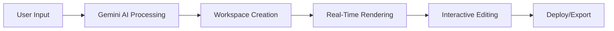

# 🪐 Astra AI

> **"Describe. Generate. Launch — with Astra AI."**

An advanced **AI-powered Next.js website builder** that transforms your ideas into fully functional, responsive websites — instantly. Powered by **Google Gemini**, Astra AI bridges the gap between imagination and creation, letting anyone design and deploy modern web experiences just by describing them in plain English.

[](https://nextjs.org/)
[](https://reactjs.org/)
[](https://tailwindcss.com/)
[](https://www.convex.dev/)

---

## 🚀 Overview

Imagine typing:

> *"Build a sleek portfolio website for a freelance photographer with a gallery and contact form."*

Within seconds, **Astra AI** understands your intent, generates the website structure, layout, and content, and launches a personalized **AI workspace** where you can view, edit, and publish your new site.

✨ **No manual coding.**  
✨ **No design complexity.**  
✨ **Just you, your vision, and Astra's intelligence.**

---

## 🧠 How It Works



1. **📝 Prompt Input**  
   Users describe their website idea on the homepage — portfolio, blog, business site, landing page, or app dashboard.

2. **🧠 AI Understanding (Gemini API)**  
   Google Gemini processes the input and generates the complete website blueprint — layout, color palette, content, and UI components.

3. **⚙️ Workspace Generation (Convex Backend)**  
   A new workspace is automatically created using Convex, storing user sessions, chat messages, and generated files.

4. **💬 Interactive AI Editing**  
   Inside the workspace, users can chat with Astra to modify the design:
   - *"Change the theme to dark mode"*
   - *"Add a contact form"*
   - *"Make the hero section gradient blue"*

5. **⚡ Real-Time Deployment (Next.js)**  
   Websites are rendered dynamically in a Next.js 15 environment with smooth previews and instant updates.

---

## 💡 Key Features

| Feature | Description |
|---------|-------------|
| 🪄 **AI Website Builder** | Powered by Gemini — just describe your idea, and Astra builds it |
| ⚙️ **Smart Workspaces** | Each prompt creates a unique workspace where your AI website lives |
| 🧠 **Contextual Memory** | Astra remembers user messages for personalized continuation |
| 👤 **User Authentication** | Secure session management with Google OAuth integration |
| 💬 **Prompt Suggestions** | Ready-made ideas to inspire users and speed up the process |
| 🎨 **Modern UI/UX** | Minimal, futuristic interface with dark mode support |
| 🔁 **Real-Time Updates** | Convex handles workspace creation, storage, and mutations efficiently |
| 📱 **Fully Responsive** | All generated websites work seamlessly across devices |
| 💳 **Payment Integration** | PayPal integration for premium features (coming soon) |
| 🧩 **Code Preview** | Sandpack integration for live code editing and preview |

---

## 🧰 Tech Stack

### **Frontend**
- ⚛️ **Next.js 15** (App Router) - React framework for production
- 🎨 **TailwindCSS 3.4** - Utility-first CSS framework
- 🧩 **React 18.3** - UI library with hooks and context
- 💎 **Lucide React** - Beautiful, consistent icons
- 🎭 **shadcn/ui** - Radix UI components with Tailwind
- 🌓 **next-themes** - Dark mode support
- 📝 **React Markdown** - Markdown rendering for AI responses

### **Backend & Database**
- ☁️ **Convex 1.17** - Real-time backend with automatic sync
- 🔐 **Google OAuth** - Secure authentication
- 💳 **PayPal SDK** - Payment processing

### **AI & Generation**
- 🧠 **Google Gemini API** - Advanced AI for website generation
- 🎯 **Axios** - HTTP client for API calls

### **Developer Experience**
- 📦 **Sandpack** - Interactive code playground
- 🎨 **CVA** - Class Variance Authority for component variants
- 🧹 **clsx & tailwind-merge** - Utility class management
- 🔔 **Sonner** - Toast notifications
- 🆔 **UUID** - Unique identifier generation

---

## 📦 Installation

### Prerequisites
- Node.js 20.x or higher
- npm, yarn, or pnpm
- Convex account
- Google Gemini API key

### Setup

1. **Clone the repository**
```bash
git clone https://github.com/priyyannshhu/astra-ai.git
cd astra-ai
```

2. **Install dependencies**
```bash
npm install
# or
yarn install
# or
pnpm install
```

3. **Set up environment variables**
```bash
# Create .env.local file
touch .env.local
```

Add the following variables:
```env
# Convex
CONVEX_DEPLOYMENT=your_convex_deployment_url
NEXT_PUBLIC_CONVEX_URL=your_convex_url

# Google Gemini
GOOGLE_GEMINI_API_KEY=your_gemini_api_key

# Google OAuth
NEXT_PUBLIC_GOOGLE_CLIENT_ID=your_google_client_id

# PayPal (optional)
NEXT_PUBLIC_PAYPAL_CLIENT_ID=your_paypal_client_id
```

4. **Initialize Convex**
```bash
npx convex dev
```

5. **Run the development server**
```bash
npm run dev
```

6. **Open your browser**
```
http://localhost:3000
```

---

## 🎯 Usage

### Basic Workflow

1. **🏠 Visit Homepage**  
   Navigate to the landing page and explore prompt suggestions

2. **✍️ Enter Your Idea**  
   Describe the website you want to create in natural language

3. **🔐 Sign In**  
   Authenticate using Google OAuth (if not already signed in)

4. **⚡ Generate Workspace**  
   Astra AI creates a personalized workspace with your generated website

5. **💬 Refine with AI Chat**  
   Use the interactive chat to modify colors, layout, content, and components

6. **👀 Preview & Export**  
   View your website in real-time and export when ready

### Example Prompts

```
✨ "Create a modern landing page for a SaaS product with pricing tiers"
✨ "Build a portfolio website for a UX designer with case studies"
✨ "Design a blog with dark mode and a newsletter subscription"
✨ "Make a restaurant website with menu and online ordering"
```

---

## 🤝 Contributing

Contributions are welcome! This project is still in active development.

1. Fork the repository
2. Create your feature branch (`git checkout -b feature/AmazingFeature`)
3. Commit your changes (`git commit -m 'Add some AmazingFeature'`)
4. Push to the branch (`git push origin feature/AmazingFeature`)
5. Open a Pull Request

---

## 📄 License

This project is currently private. All rights reserved.

---

## 🌈 Vision

Astra AI isn't just a website builder — it's a **creative partner for developers, designers, and entrepreneurs**.

Our mission is to make **website creation as natural as conversation** — empowering anyone to bring their digital vision to life in seconds, with AI as their co-designer.

We envision Astra AI as a **no-code + AI revolution** where:
- ⚡ Developers save hours of repetitive setup
- 🎨 Designers focus on creativity, not code
- 🚀 Non-technical creators build professional sites with confidence

---

## 👨‍💻 Author

**Priyanshu Vishwakarma**  
Full Stack Developer | AI Builder

🔗 [GitHub](https://github.com/priyyannshhu)  
💼 [Portfolio](https://priyanshu-v.vercel.app/)  


---

## 🙏 Acknowledgments

- [Next.js](https://nextjs.org/) - The React Framework
- [Convex](https://www.convex.dev/) - Real-time backend platform
- [Google Gemini](https://ai.google.dev/) - Generative AI API
- [TailwindCSS](https://tailwindcss.com/) - Styling framework
- [shadcn/ui](https://ui.shadcn.com/) - Component library
- [Sandpack](https://sandpack.codesandbox.io/) - Code playground

---

<div align="center">

### ⭐ Star this repo if you find it useful!

**Made with ❤️ and AI**

</div>