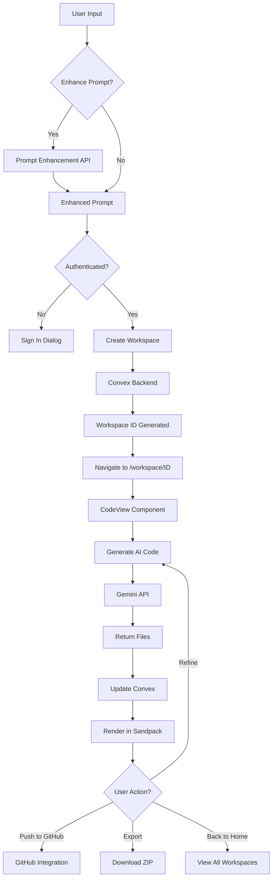

# 🪐 Astra AI

> **"Transform ideas into production-ready apps — instantly."**

Astra AI is an intelligent **AI-powered application builder** that converts natural language descriptions into fully functional, interactive web applications. Built with **Next.js 15**, **React 19**, and powered by **Google Gemini AI**, Astra AI eliminates the complexity of traditional development workflows.

[](https://nextjs.org/)
[](https://reactjs.org/)
[](https://tailwindcss.com/)
[](https://www.convex.dev/)

---

## ✨ What Makes Astra AI Different?

Unlike traditional no-code builders, Astra AI understands **intent**, not just templates. It generates complete, working applications with:

- **Real-time code generation** using Sandpack
- **Interactive AI chat** for iterative refinement
- **Full-stack architecture** with file management
- **AI-powered prompt enhancement** for better results
- **GitHub integration** for seamless version control
- **Previous workspace history** for easy project access
- **Instant deployment** capabilities
- **Token-based usage** system

Simply describe what you want to build, and Astra AI handles the rest — from component architecture to styling, interactions, and state management.

---

## 🎯 Core Features

### 🧠 **Intelligent Code Generation**
- **Context-aware AI** that generates React components, HTML/CSS, and JavaScript
- **AI prompt enhancement** - automatically improve your prompts for better code generation
- **File structure management** with automatic imports and dependencies
- **Iterative refinement** through conversational prompts
- **Multi-file projects** with proper organization

### ⚡ **Real-Time Development Environment**
- **Live code preview** using Sandpack integration
- **Hot reload** for instant visual feedback
- **File explorer** with multi-file support
- **Code editor** with syntax highlighting

### 💬 **AI-Powered Chat Interface**
- **Contextual conversations** that remember project history
- **Natural language editing** — just ask for changes
- **Markdown rendering** for rich AI responses
- **Error handling** with helpful suggestions

### 🔐 **User Management & Authentication**
- **Google OAuth integration** for secure sign-in
- **Token-based system** for usage tracking
- **Persistent workspaces** tied to user accounts
- **Profile management** with dropdown menu

### 📦 **Workspace Management**
- **Automatic workspace creation** for each project
- **Previous workspace history** - access your recent projects instantly
- **Real-time file synchronization** via Convex
- **Relative time display** (just now, 2 hours ago, etc.)
- **Project preview cards** with message counts and file status
- **Export functionality** to download projects
- **Deploy capabilities** for production deployment

### 🐙 **GitHub Integration**
- **OAuth authentication** for secure GitHub access
- **Push to GitHub** directly from the workspace
- **Repository configuration** (public/private, custom naming)
- **Initial commit** with workspace code
- **Seamless version control** integration

### 🎨 **Modern User Interface**
- **Dark theme** with gradient animations
- **Responsive design** across all devices
- **Intuitive navigation** between code and preview
- **Professional styling** with Tailwind CSS 4.0
- **Back to home** button for easy navigation from workspace
- **Animated gradient backgrounds** for immersive experience

---

## 🛠️ Technology Stack

### **Frontend Framework**
- **Next.js 15.5** - App Router with Server Components
- **React 19.1** - Latest with improved hooks and concurrent features
- **TypeScript** - Type-safe development (inferred from code structure)

### **Styling & UI**
- **Tailwind CSS 4.0** - Latest utility-first CSS framework
- **shadcn/ui** - Radix UI primitives with custom styling
- **Framer Motion** - Advanced animations and interactions
- **Lucide React** - Modern icon library

### **Code Editor & Sandbox**
- **@codesandbox/sandpack-react** - Interactive code playground
- **React Markdown** - Markdown rendering for AI chat

### **Backend & Database**
- **Convex 1.27** - Real-time backend with automatic sync
- **API Routes** - Next.js serverless functions for AI integration

### **AI & Generation**
- **Google Gemini API** - Advanced language model for code generation
- **Prompt Enhancement API** - AI-powered prompt optimization
- **Axios** - HTTP client for API communication
- **Custom prompts** - Specialized prompt engineering for code generation

### **Authentication & Payments**
- **@react-oauth/google** - Google OAuth 2.0 integration
- **GitHub OAuth** - GitHub authentication for version control
- **PayPal SDK** - Payment processing integration

### **Version Control**
- **GitHub API** - Repository creation and code pushing
- **Octokit** - GitHub REST API client

### **Utilities**
- **UUID** - Unique identifier generation
- **JSZip** - Project export functionality
- **File Saver** - Client-side file downloads
- **Sonner** - Toast notifications

---

## 📦 Installation & Setup

### Prerequisites
```bash
Node.js 20.x or higher
npm/yarn/pnpm package manager
Google Cloud Console project (for OAuth)
GitHub OAuth App (for GitHub integration)
Google AI Studio account (for Gemini API)
Convex account
```

### 1. Clone the Repository
```bash
git clone https://github.com/priyyannshhu/astra-ai.git
cd astra-ai
```

### 2. Install Dependencies
```bash
npm install
# or
yarn install
# or
pnpm install
```

### 3. Environment Configuration

Create a `.env.local` file in the root directory:

```env
# Convex Backend
CONVEX_DEPLOYMENT=your_convex_deployment_id
NEXT_PUBLIC_CONVEX_URL=https://your-project.convex.cloud

# Google Gemini AI
GOOGLE_GEMINI_API_KEY=your_gemini_api_key_here

# Google OAuth
NEXT_PUBLIC_GOOGLE_CLIENT_ID=your_google_oauth_client_id

# GitHub OAuth
NEXT_PUBLIC_GITHUB_CLIENT_ID=your_github_client_id
GITHUB_CLIENT_SECRET=your_github_client_secret

# PayPal (Optional - for payments)
NEXT_PUBLIC_PAYPAL_CLIENT_ID=your_paypal_client_id
```

### 4. Setup GitHub OAuth App

1. Go to [GitHub Developer Settings](https://github.com/settings/developers)
2. Click "New OAuth App"
3. Fill in the details:
   - **Application name**: Astra AI
   - **Homepage URL**: `http://localhost:3000`
   - **Authorization callback URL**: `http://localhost:3000/api/auth/github/callback`
4. Copy the Client ID and Client Secret to your `.env.local`

### 5. Initialize Convex Backend

```bash
# Login to Convex
npx convex login

# Initialize project
npx convex dev
```

This will:
- Create necessary database tables
- Set up real-time subscriptions
- Deploy backend functions

### 6. Start Development Server

```bash
npm run dev
```

Visit `http://localhost:3000` to see Astra AI in action.

### 7. Build for Production

```bash
npm run build
npm start
```

---

## 🚀 Usage Guide

### Getting Started

1. **🏠 Landing Page**
   - View the hero section with animated gradients
   - See your previous workspaces (if logged in)
   - Explore suggested prompts for inspiration
   - Enter your app idea in the textarea

2. **🔐 Authentication**
   - Click "Get Started" or "Sign In"
   - Authenticate using Google OAuth
   - Your profile appears in the header

3. **✨ Prompt Enhancement**
   - Type your initial idea
   - Click the **Wand icon** (✨) to enhance your prompt
   - AI will optimize your prompt for better code generation
   - Review the enhanced prompt and generate

4. **⚡ Workspace Creation**
   - Submit your prompt (enhanced or original)
   - Astra AI creates a dedicated workspace
   - Automatically redirected to `/workspace/[id]`

5. **💻 Development Environment**
   - **Code Tab**: View and edit generated files
   - **Preview Tab**: See live application
   - **File Explorer**: Navigate between files
   - **Chat Panel**: Refine with conversational prompts
   - **Back to Home**: Navigate back to see all projects

6. **📂 Access Previous Workspaces**
   - Return to home page
   - Scroll to "Your Recent Projects" section
   - Click any workspace card to continue working
   - See message counts and last modified time

7. **🎨 Iterative Refinement**
   ```
   User: "Add a delete button to each todo item"
   AI: [Updates code with delete functionality]
   
   User: "Change the theme to purple"
   AI: [Modifies color scheme to purple gradient]
   
   User: "Add local storage persistence"
   AI: [Implements state persistence]
   ```

8. **🐙 Push to GitHub**
   - Click "Push to GitHub" button in workspace
   - First time: Authenticate with GitHub OAuth
   - Configure repository name and visibility
   - Click "Push to GitHub" to create repo and commit code
   - Your project is now on GitHub!

9. **📤 Export & Deploy**
   - Click "Export" to download project as ZIP
   - Click "Deploy" to push to production (feature in development)

---

## 💡 Example Prompts

### Simple Applications
```
✨ "Create a calculator with basic operations"
✨ "Build a countdown timer with start/stop functionality"
✨ "Make a color picker with hex code display"
```

### Interactive Dashboards
```
✨ "Design an analytics dashboard with charts"
✨ "Build a project management kanban board"
✨ "Create a weather app with city search"
```

### E-commerce Components
```
✨ "Generate a product card grid with filters"
✨ "Build a shopping cart with quantity controls"
✨ "Create a checkout form with validation"
```

### Content Platforms
```
✨ "Design a blog layout with categories"
✨ "Build a portfolio with project showcase"
✨ "Create a landing page with hero and CTA sections"
```

### Using Prompt Enhancement
```
Before: "make a todo app"
After Enhancement: "Create a modern, responsive todo application with 
add/delete functionality, priority levels, dark mode toggle, and local 
storage persistence. Include smooth animations and a clean UI."
```

---

## 🏗️ Architecture Overview

### File Structure
```
astra-ai/
├── app/                          # Next.js 15 App Router
│   ├── api/                      # API routes
│   │   ├── ai-chat/              # Chat AI endpoint
│   │   ├── gen-ai-code/          # Code generation endpoint
│   │   ├── enhance-prompt/       # Prompt enhancement endpoint
│   │   └── auth/
│   │       └── github/
│   │           └── callback/     # GitHub OAuth callback
│   ├── workspace/[id]/           # Dynamic workspace routes
│   └── page.jsx                  # Homepage
├── components/
│   ├── custom/                   # Custom components
│   │   ├── ChatView.jsx          # AI chat interface
│   │   ├── CodeView.jsx          # Code editor & preview
│   │   ├── Header.jsx            # Navigation header
│   │   ├── Hero.jsx              # Landing page hero
│   │   └── SignInDialog.jsx      # Authentication dialog
│   └── ui/                       # shadcn/ui components
├── context/                      # React Context providers
│   ├── ActionContext.jsx         # Export/deploy/GitHub actions
│   ├── MessagesContext.jsx       # Chat message state
│   └── UserDetailContext.jsx     # User authentication state
├── convex/                       # Convex backend
│   ├── schema.ts                 # Database schema
│   ├── workspace.ts              # Workspace mutations & queries
│   └── users.ts                  # User management
├── data/                         # Static configuration
│   ├── Colors.js                 # Theme colors
│   ├── Lookup.js                 # Constants and suggestions
│   └── Prompt.js                 # AI prompt templates
└── public/                       # Static assets
```

### Data Flow



### Key Components

**Hero.jsx** - Landing page entry point
- Handles initial prompt submission
- Prompt enhancement with AI
- Creates workspace via Convex mutation
- Displays previous workspaces with preview cards
- Manages authentication state
- Relative time formatting for workspace cards
- Navigation to existing workspaces

**CodeView.jsx** - Main development environment
- Integrates Sandpack for code editing
- Manages file state and updates
- Handles token consumption tracking
- Switches between Code/Preview tabs

**ChatView.jsx** - AI conversation interface
- Displays message history
- Sends prompts to AI chat endpoint
- Renders markdown responses
- Handles error states

**Header.jsx** - Navigation and user management
- Google OAuth integration
- GitHub OAuth integration
- Export/Deploy action triggers
- Push to GitHub functionality
- User profile dropdown
- Back to home button (workspace only)
- Context-aware button visibility

**ActionContext.jsx** - Action management
- Handles export functionality
- Manages deployment process
- GitHub push integration
- Repository creation and code upload
- Loading states and error handling

---

## 🔧 Configuration

### Convex Schema
```typescript
// convex/schema.ts
export default defineSchema({
  workspaces: defineTable({
    userId: v.id("users"),
    messages: v.array(v.object({
      role: v.string(),
      content: v.string(),
    })),
    fileData: v.optional(v.any()),
  }),
  users: defineTable({
    name: v.string(),
    email: v.string(),
    picture: v.string(),
    token: v.number(),
  }),
});
```

### API Endpoints

#### Prompt Enhancement
```javascript
// app/api/enhance-prompt/route.js
POST /api/enhance-prompt
Body: { prompt: string }
Response: { enhancedPrompt: string }
```

#### GitHub OAuth Callback
```javascript
// app/api/auth/github/callback/route.js
GET /api/auth/github/callback?code=xxx
Sets github_token cookie
Redirects to home
```

#### Push to GitHub
```javascript
// Used in ActionContext
handleAction("pushToGithub", {
  repoName: string,
  isPrivate: boolean,
  commitMessage: string,
  workspaceCode: object
})
```

### Sandpack Dependencies
```javascript
// From Lookup.js
DEPENDANCY: {
  "axios": "latest",
  "lucide-react": "latest",
  "react-router-dom": "latest",
  // Add more as needed
}
```

### AI Prompts
```javascript
// From Prompt.js
CODE_GEN_PROMPT: "Generate React components with hooks..."
CHAT_PROMPT: "Provide helpful development guidance..."
ENHANCE_PROMPT: "Enhance and optimize this prompt..."
```

---

## 🎨 Customization

### Adding New Dependencies
```javascript
// data/Lookup.js
export default {
  DEPENDANCY: {
    "your-library": "version",
  }
}
```

### Modifying AI Behavior
```javascript
// data/Prompt.js
export default {
  CODE_GEN_PROMPT: "Your custom system prompt...",
  CHAT_PROMPT: "Your custom chat instructions...",
  ENHANCE_PROMPT: "Your custom enhancement logic...",
}
```

### Styling Changes
```jsx
// Modify Tailwind classes or update theme
// components use inline styles with Colors.js constants
```

### Customizing Workspace Cards
```jsx
// Hero.jsx - Modify workspace card rendering
<div className="group relative bg-gradient-to-br...">
  {/* Customize preview section */}
  {/* Customize metadata display */}
  {/* Customize hover effects */}
</div>
```

---

## 🤝 Contributing

We welcome contributions! Here's how to get started:

1. **Fork the repository**
2. **Create a feature branch**
   ```bash
   git checkout -b feature/amazing-feature
   ```
3. **Make your changes**
4. **Test thoroughly**
   - Test prompt enhancement
   - Test GitHub push functionality
   - Test workspace history
   - Test navigation flows
5. **Commit with clear messages**
   ```bash
   git commit -m "feat: add amazing feature"
   ```
6. **Push to your fork**
   ```bash
   git push origin feature/amazing-feature
   ```
7. **Open a Pull Request**

### Development Guidelines
- Follow existing code style
- Add comments for complex logic
- Test across different prompts
- Update documentation as needed
- Ensure OAuth flows work correctly
- Test workspace persistence

---

## 🐛 Known Issues & Limitations

- Token system requires manual refresh
- Export feature downloads code only (no dependencies automatically installed)
- Deploy functionality in development
- Large projects may hit token limits
- Sandpack has limited library support
- GitHub push requires OAuth authentication each session (no refresh token)
- Workspace cards limited to 6 on home page (view all for more)

---

## 🗺️ Roadmap

### Phase 1 (Current) ✅
- ✅ Core code generation
- ✅ Real-time workspace
- ✅ AI chat refinement
- ✅ User authentication
- ✅ Prompt enhancement
- ✅ GitHub integration
- ✅ Previous workspace history

### Phase 2 (In Progress) 🔄
- 🔄 Token purchase system
- 🔄 Project templates
- 🔄 Code export improvements
- 🔄 Deploy to production
- 🔄 GitHub refresh token support
- 🔄 Workspace search and filtering

### Phase 3 (Planned) 📋
- 📋 Collaborative editing
- 📋 Version control history
- 📋 Custom AI models
- 📋 Advanced analytics
- 📋 GitLab/Bitbucket integration
- 📋 Workspace folders/organization
- 📋 Code diff visualization
- 📋 AI-powered code review

---

## 📄 License

This project is private and proprietary. All rights reserved.

For licensing inquiries, contact the author.

---

## 👨‍💻 Author

**Priyanshu Vishwakarma**  
Full Stack Developer | AI Enthusiast

- 🔗 [GitHub](https://github.com/priyyannshhu)
- 💼 [Portfolio](https://priyanshu-v.vercel.app/)
- 📧 Contact via GitHub

---

## 🙏 Acknowledgments

Special thanks to the amazing open-source community:

- **[Next.js Team](https://nextjs.org/)** - For the incredible React framework
- **[Convex](https://www.convex.dev/)** - For real-time backend magic
- **[Google AI](https://ai.google.dev/)** - For Gemini API access
- **[GitHub](https://github.com/)** - For OAuth and API integration
- **[CodeSandbox](https://codesandbox.io/)** - For Sandpack playground
- **[shadcn](https://ui.shadcn.com/)** - For beautiful UI components
- **[Tailwind Labs](https://tailwindcss.com/)** - For utility-first CSS
- **[Lucide](https://lucide.dev/)** - For beautiful icons

---

## 📞 Support

If you encounter issues or have questions:

1. Check existing [GitHub Issues](https://github.com/priyyannshhu/astra-ai/issues)
2. Open a new issue with detailed information
3. Provide reproduction steps and screenshots
4. For GitHub integration issues, check OAuth configuration

---

## 🔐 Security

- All authentication uses OAuth 2.0
- GitHub tokens are stored securely in HTTP-only cookies
- API keys are never exposed to the client
- User data is encrypted in transit and at rest
- Regular security audits recommended

---

## 🚀 Performance Tips

- Use prompt enhancement for better code generation
- Keep workspaces organized by project type
- Export projects regularly as backups
- Use GitHub push for version control
- Clear old workspaces to improve load times

---

<div align="center">

### ⭐ Star this repository if Astra AI helps you build faster!

**Built with 💜 by developers, for developers**

*Formerly known as MERN AI*

---

**[Live Demo](https://astra-aii.vercel.app)** • **[Documentation](#)** • **[Changelog](#)**

[](https://github.com/priyyannshhu/astra-ai)
[](https://github.com/priyyannshhu/astra-ai)

</div>